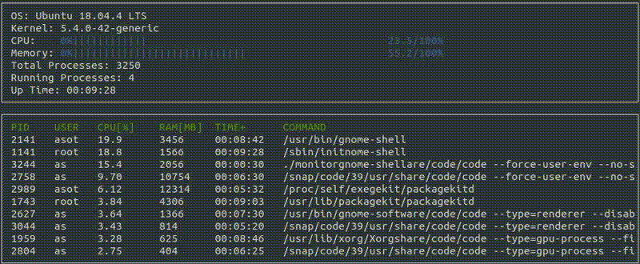
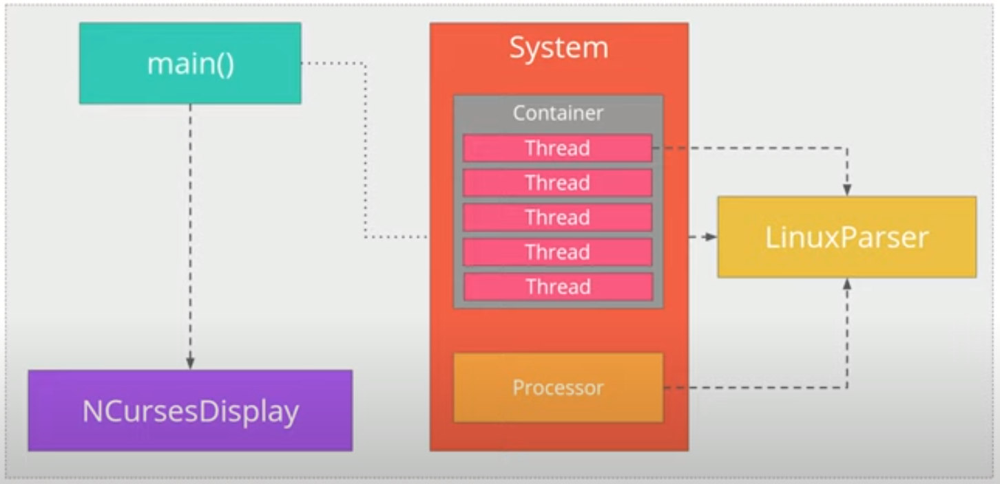

# CppND-System-Monitor

Udacity C++ Nanodegree Program

## Overview

The program for monitoring Linux systems was developed in System Monitor Project in the Object Oriented Programming Course of the [Udacity C++ Nanodegree Program](https://www.udacity.com/course/c-plus-plus-nanodegree--nd213). 

  

## Dependencies

### ncurses
[ncurses](https://www.gnu.org/software/ncurses/) is a library that facilitates text-based graphical output in the terminal. This project relies on ncurses for display output.

Within the Udacity Workspace, `.student_bashrc` automatically installs ncurses every time you launch the Workspace.

If you are not using the Workspace, install ncurses within your own Linux environment: `sudo apt install libncurses5-dev libncursesw5-dev`

### Make
This project uses [Make](https://www.gnu.org/software/make/). The Makefile has four targets:
* `build` compiles the source code and generates an executable
* `format` applies [ClangFormat](https://clang.llvm.org/docs/ClangFormat.html) to style the source code
* `debug` compiles the source code and generates an executable, including debugging symbols
* `clean` deletes the `build/` directory, including all of the build artifacts

## Build Instructions

* Clone the repository
* Create `build` directory 
* From build directory execute `cmake ..` and `make`
* Start the program with `./monitor`

## Program Structure

  

* The class `System` represents the Linux computer, which contains following sub-classes:
  * Class `Process` which represents the processes running in the system
  * Class `Processor` which represents the information about computer processor such as CPU load, etc.
* Namespace `LinuxParser` containse functions for parcing of system files
* Namespace `NCursesDisplay` displays the system information  as graphical output in the terminal

## Results

The System Monitor is organized in object-oriented way to display Linux system information with the time step of 1 second:
* OS version and kernel
* CPU and RAM load
* Total amount of processes and running processes
* For each process the additional information is displayed:
  * Process ID
  * User
  * CPU and RAM load
  * Up-time

The displayed information is obtained by parcing of system files.

