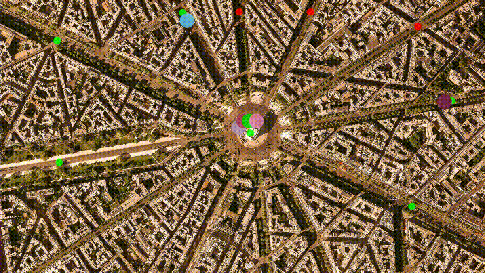

# CPPND: Concurrent Traffic Simulation

Udacity C++ Nanodegree Program

## Overview

  

This is the project for the fourth course in the [Udacity C++ Nanodegree Program](https://www.udacity.com/course/c-plus-plus-nanodegree--nd213): Concurrency. 

Throughout the Concurrency course, a traffic simulation was developed in which vehicles are moving along streets and are crossing intersections. However, with increasing traffic in the city, traffic lights are needed for road safety. Each intersection will therefore be equipped with a traffic light. In this project, a suitable and thread-safe communication protocol between vehicles and intersections was built, using concurrent programming (such as mutexes, locks and message queues).

## Dependencies for Running Locally
* cmake >= 2.8
  * All OSes: [click here for installation instructions](https://cmake.org/install/)
* make >= 4.1 (Linux, Mac), 3.81 (Windows)
  * Linux: make is installed by default on most Linux distros
  * Mac: [install Xcode command line tools to get make](https://developer.apple.com/xcode/features/)
  * Windows: [Click here for installation instructions](http://gnuwin32.sourceforge.net/packages/make.htm)
* OpenCV >= 4.1
  * The OpenCV 4.1.0 source code can be found [here](https://github.com/opencv/opencv/tree/4.1.0)
* gcc/g++ >= 5.4
  * Linux: gcc / g++ is installed by default on most Linux distros
  * Mac: same deal as make - [install Xcode command line tools](https://developer.apple.com/xcode/features/)
  * Windows: recommend using [MinGW](http://www.mingw.org/)

## Basic Build Instructions

1. Clone this repo.
2. Make a build directory in the top level directory: `mkdir build && cd build`
3. Compile: `cmake .. && make`
4. Run it: `./traffic_simulation`.

## Project Structure

The project is organazied in object-oriented way and has following structure:

* Class `Graphics` is used to display the graphical traffic simulation
* Class `Street` represents a street on the map
* Class `TrafficLight` represents a traffic light on a intersection of streets toggling between green and red  
* Class `Intersection` represents the streets intersection with traffic light and vehicle queue waiting to enter the intersection. 
* Class `Vehicle` represents the vehicles moving on the streets or waiting on the intersections

## Results

Six vehicles are moving on the streets simultaneously. Also there are traffic lights toggling between green and red on the street intersections. The vehicles have to wait on the intersections for green light and enter the intersections with the right order. To achieve this the concurrent programming was used in C++:

* The traffic lights toggle green and red between 4 and 6 seconds in a thread. To avoid data races `std::mutex`, `std::unique_lock` and `std::lock_guard` are used. Once the traffic light phase is changed, `std::condition_variable` can be used to notify about it.

* If many cars come to the intersection, they should wait in a queue to enter. Each car has to wait until it is allowed to enter the intersection (green light and right order). For this data communication between threads `std::promise` and `std::future` are used. Using the functions `promise.get_future()` and `future.wait()` the information from the thread can be obtained, if the vehicle can enter the intersection.

* Many threads can access vehicle object using `std::shared_ptr`. And to avoid data races the `std::lock_guard` mechanism is used.

* `std::unique_lock` and `std::lock_guard` have advantage over using `std::mutex` lock and unlock directly, because they use RAII mechanism which unlocks thread automaticaly if the lock goes out of scope.

