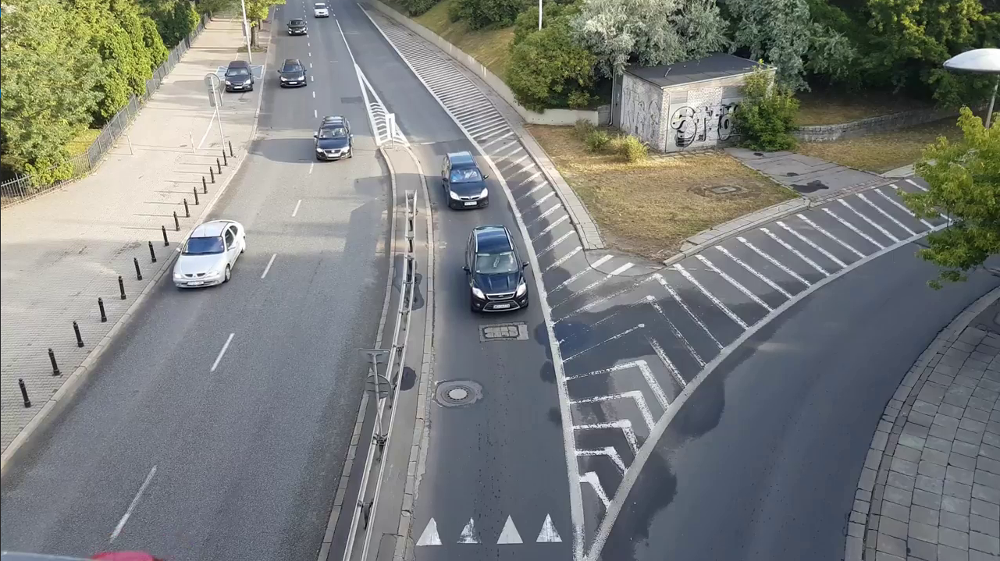
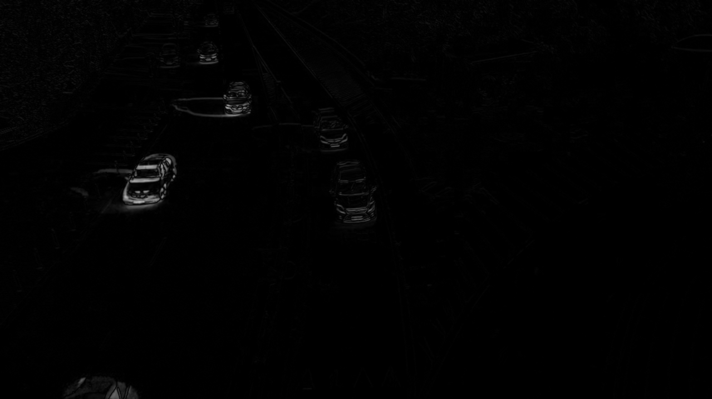
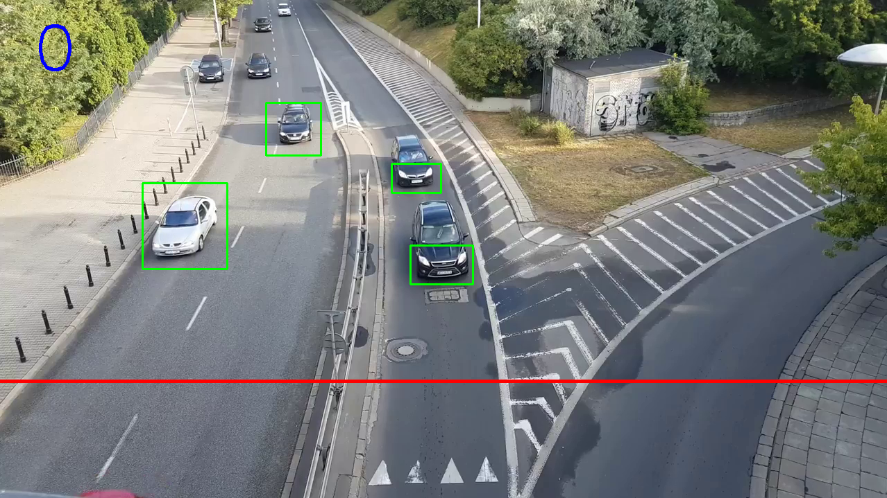

# CPPND: Capstone Car Counting Project

Udacity C++ Nanodegree Program

# Overview
This application detects cars from the video and counts them

  

1. Car counting application recieves a [video file](./data/0-10s_.mp4)  with driving cars.
2. The video is processed using `OpenCV` library to detect driving cars and count them
3. The application reads configuration parameters stored in [XML-file](./data/data.xml) for video processing using `pugixml`
4. Video is loaded from the [source](https://www.youtube.com/watch?v=MNn9qKG2UFI)

## Overview of project structure

The Application has 4 classes:

1. VideoProcessing

  * load the [video](./data/0-10s_.mp4)
  * process each frame of the video using `OpenCV` library functions:

  

 Original frame 

  * Detect driving cars by current and previous frames image substraction and using of user-defined parameters, which are stored in XML-file

  

    

 Frame difference 

  * make a binary image using threshold

    

 Threshold 

  * Using thresholded image detect vehicles, if they satisfy  certain width, height, area and side relation. Draw the green rectangle on the detected vehicles.

    

 Detected vehicles 

  * counting the detected cars, when they pass the counting line

2. ParsingXML
  * loads XML-file (workspace/data/1-10s.mp4) using pugixml library
  * reads application parameters

3. ObjectTracking
  * manage detected cars: add new cars, track existing cars, delete cars which are already counted or out of scope. 
  
  * Vehicle tracking is important, because some vehicles can be lost because of noize, different light conditions etc. Then the same vehicle can be detected and counted twice which decrease the accuracy. Vehicle tracking helps to track the detected vehicles from the point of first detection and to the red line, where they are counted.

  

 Object tracking 

4. DetectedObject
  * represents a detected object (car) from the video

### Explanation of how the project satisfies the necessary rubric

1. A variety of control structures are used in the project. The project code is clearly organized into functions.
2. The project reads data from a file and process the data.
  * Class ParsingXML has functionality to parse XML-file, where application configuration parameters are store. (ParsingXML.cpp: 3)
  * Class VideoProcessing has functionality to load a video file for further processing. (VideoProcessing.cpp: 8)
3. The project uses Object Oriented Programming techniques.  (DetectedObject.cpp: 12)
4. Classes use appropriate access specifiers for class members. (DetectedObject.h: 14, 45)
5. Class constructors utilize member initialization lists. (VideoProcessing.cpp: 6)
6. Classes encapsulate behavior. (VideoProcessing.cpp: 114)
7. The project makes use of references in function declarations. (VideoProcessing.cpp: 95); (DetectedObject.cpp: 6)
8. The project uses scope / Resource Acquisition Is Initialization (RAII) where appropriate. (VideoProcessing.cpp: 20)
9. The project uses move semantics to move data, instead of copying it, where possible. (VideoProcessing.cpp: 116)
10. The project uses smart pointers instead of raw pointers. (VideoProcessing.cpp: 8)

## Dependencies for Running Locally
* cmake >= 3.7
  * All OSes: [click here for installation instructions](https://cmake.org/install/)
* make >= 4.1 (Linux, Mac), 3.81 (Windows)
  * Linux: make is installed by default on most Linux distros
  * Mac: [install Xcode command line tools to get make](https://developer.apple.com/xcode/features/)
  * Windows: [Click here for installation instructions](http://gnuwin32.sourceforge.net/packages/make.htm)
* gcc/g++ >= 5.4
  * Linux: gcc / g++ is installed by default on most Linux distros
  * Mac: same deal as make - [install Xcode command line tools](https://developer.apple.com/xcode/features/)
  * Windows: recommend using [MinGW](http://www.mingw.org/)
* pugixml >= 1.10
  * workspace/lib/pugixml
  * [https://pugixml.org/docs/manual.html]
* ffmpeg >= 3.4.6
  * sudo apt install ffmpeg
* OpenCV >= 4.1
  * Installation

  * Install dependencies
  * sudo apt-get install libavcodec-dev libavformat-dev libswscale-dev
  * sudo apt-get install libgstreamer-plugins-base1.0-dev libgstreamer1.0-dev

  * git clone https://github.com/opencv/opencv.git
  * git clone https://github.com/opencv/opencv_contrib.git
  * cd opencv
  * mkdir build
  * cd build
  * cmake -D CMAKE_BUILD_TYPE=RELEASE \ -D CMAKE_INSTALL_PREFIX=/usr/local \ -D OPENCV_EXTRA_MODULES_PATH=~/opencv_build/opencv_contrib/modules \ -D WITH_GSTREAMER=ON \ -D WITH_FFMPEG=ON ..

  * make
  * sudo make install
  * sudo ldconfig

## Basic Build Instructions

1. Clone this repo.
2. Make a build directory in the top level directory: `mkdir build && cd build`
3. Compile: `cmake .. && make`
4. Run it: `./car_counting`.