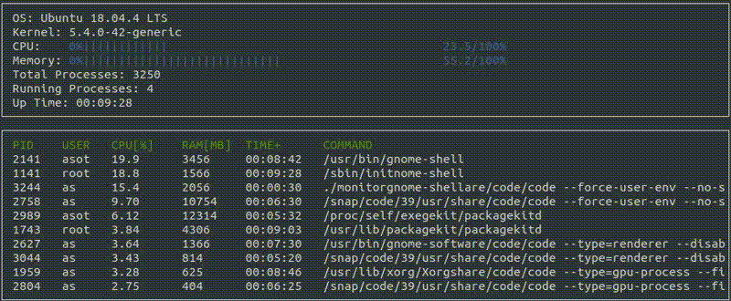
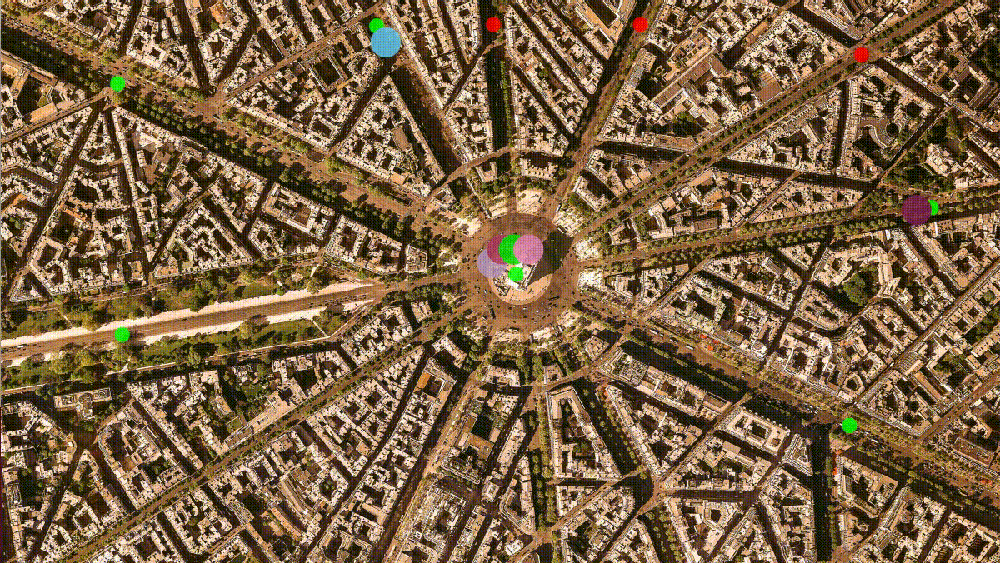

# Udacity C++ Developer Nanodegree Projects

## Overview

This repository contains projects completed during [Udacity C++ Nanodegree Program](https://www.udacity.com/course/c-plus-plus-nanodegree--nd213) from the Self-Driving Car rubric.

## Projects completed during Udacity C++ Nanodegree

### 1. [Route Planning Project](https://github.com/alekseikruglov/Udacity-Cpp-Developer-Nanodegree-Projects/tree/master/Project_1_Route-Planning)

* **Summary:** Use OpenStreetMap data and the IO2D visualization library to build a route planner that finds a path between two points on a real-world map

* **Keywords:** C++, cmake, make, Pointers and References, A-Star Search Algorithm, XML-parsing, OpenCV, IO2D

  

### 2. [System Monitor Project](https://github.com/alekseikruglov/Udacity-Cpp-Developer-Nanodegree-Projects/tree/master/Project_2_System-Monitor)

* **Summary:** Display Linux system information: OS and kernel versions, CPU and RAM load, number of processes, information about each process, etc.

* **Keywords:** C++, Object-Oriented Programming, Parcing of Linux System Information Files, ncurses

  

### 3. [Memory Management Project](https://github.com/alekseikruglov/Udacity-Cpp-Developer-Nanodegree-Projects/tree/master/Project_3_Memory-Management-Chatbot)

* **Summary:** Optimize memory managment of the program by using of smart pointers, move semantics, RAII-technique.

* **Keywords:** C++, Object-Oriented Programming, Memory Management, Smart Pointers, Move Semantics, Rule of Three, Rule of Five, RAII, C++ Pointers, C++ References, L-Values and R-Values  

  

### 4. [Concurrent Traffic Simulation Project](https://github.com/alekseikruglov/Udacity-Cpp-Developer-Nanodegree-Projects/tree/master/Project_4_Concurrent-Traffic-Simulation)

* **Summary:** Use concurrent programming in C++ for traffic simulation with several vehicles, street intersections and traffic lights on a real urban map.

* **Keywords:** C++, Object-Oriented Programming, Concurrent Programming, Multithreading, Techniques to Avoid Data Raices, Data Exchange Between Threads

  

### 5. [Capstone Project: Vehicle Counter Project](https://github.com/alekseikruglov/Udacity-Cpp-Developer-Nanodegree-Projects/tree/master/Project_5_Capstone-Project_Car-Counter)

* **Summary:** Use OpenCV image processing to detect moving vehicles on the video, track and count them.

* **Keywords:** C++, Computer Vision, Object-Oriented Programming, Memory Management, OpenCV, File Operations

  

## License

Udacity C++ nanodegree results are released under the [MIT License](LICENSE).
